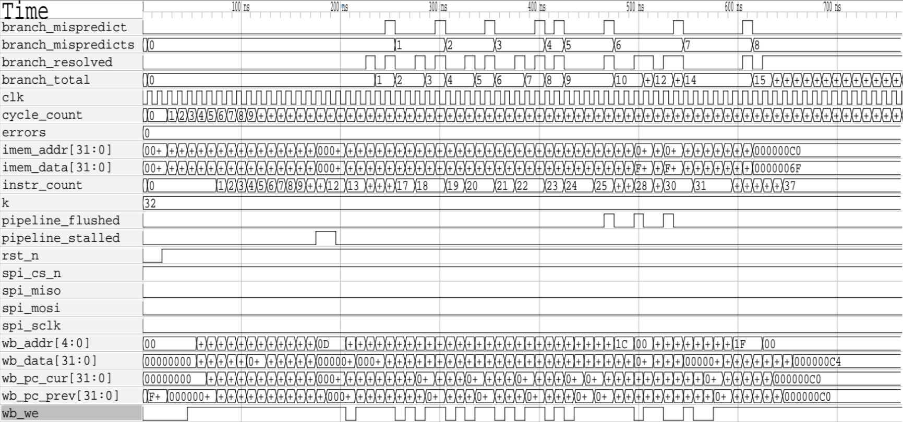

# RV32I 5-Stage Pipelined Processor with Dynamic Branch Prediction, L1 Cache, MMIO and SPI Peripheral Integration

## 1. Introduction

This project implements a synthesizable RV32I processor in Verilog featuring a five-stage in-order pipeline augmented with dynamic branch prediction, operand forwarding, hazard detection, cache-based memory access, memory-mapped I/O, and SPI peripheral integration.

The design goes significantly beyond a minimal educational RISC-V core by incorporating several practical microarchitectural mechanisms commonly encountered in modern processors:

* Dynamic branch prediction using a Branch Target Buffer (BTB) and Branch History Table (BHT)
* Decode-stage branch resolution
* Multi-stage forwarding network
* Load-use interlocking
* Pipeline-wide memory stall propagation
* Direct-mapped L1 data cache
* Memory-mapped peripheral interface
* Runtime-configurable SPI controller

The processor follows a conventional IF–ID–EX–MEM–WB organization while exploring the tradeoffs involved in speculative execution, memory hierarchy integration, and pipeline hazard management.

---

# 2. Design Objectives

The project was developed to investigate practical processor design techniques beyond a basic five-stage pipeline.

Primary objectives included:

* Implementing a complete RV32I datapath.
* Supporting pipelined instruction execution.
* Reducing control hazards through dynamic prediction.
* Reducing data hazard penalties through forwarding.
* Integrating a realistic memory subsystem.
* Supporting memory-mapped peripherals.
* Demonstrating processor-peripheral interaction through SPI.
* Maintaining synthesizable RTL throughout the design.

Rather than maximizing ISA coverage, the emphasis was placed on microarchitectural mechanisms and system-level integration.

---

# 3. Top-Level System Architecture

The complete system consists of the processor pipeline, hazard management logic, cache subsystem, MMIO interface, and SPI peripheral.

```text
system
├── fetch
├── decode
├── regfile
├── execute
├── memory
├── writeback
├── hazard
├── cache
└── SPI Subsystem
    ├── fifo
    ├── core
    └── top
```

The top-level module acts primarily as an integration layer, wiring together pipeline stages, forwarding paths, cache interfaces, MMIO interfaces, and peripheral connections.

A notable design choice is that the processor pipeline remains largely unaware of peripheral details. Communication occurs exclusively through memory accesses routed by the memory stage.

---

# 4. Pipeline Organization

The processor implements a classic five-stage pipeline.

```text
IF → ID → EX → MEM → WB
```

Pipeline registers separate adjacent stages and allow multiple instructions to execute concurrently.

Each stage performs a specific subset of instruction processing responsibilities.

---

# 5. Instruction Fetch Stage

## Responsibilities

The fetch stage performs:

* Program counter management
* Instruction fetch
* Branch prediction lookup
* Branch target prediction
* Speculative control-flow generation
* IF/ID pipeline register updates

Unlike a simple sequential fetch unit, the fetch stage contains the complete prediction infrastructure required for speculative execution.

---

## Program Counter Selection

The next PC is chosen through a priority structure.

Highest priority is given to branch misprediction recovery.

```text
Mispredict Recovery
        ↓
Pipeline Stall
        ↓
Predicted Branch Target
        ↓
PC + 4
```

This ensures that incorrect speculation is corrected immediately.

If a branch is mispredicted, the fetch stage discards the predicted path and redirects execution to the architecturally correct destination.

---

## IF/ID Pipeline Register

The fetch stage stores:

```text
PC
Instruction
Prediction Outcome
```

within the IF/ID register.

The prediction bit is propagated into decode so that actual branch behavior can later be compared against the original prediction.

---

# 6. Dynamic Branch Prediction

One of the most sophisticated components in the design is the branch prediction subsystem.

The predictor combines:

* Branch Target Buffer
* Branch History Table
* Tag Array
* Valid Array

This allows both branch direction prediction and branch target prediction.

---

## Predictor Organization

The predictor contains:

```text
256 Entries
```

derived from:

```verilog
BT_ADDR_WIDTH = 8
```

Each entry stores:

```text
Valid Bit
2-bit Predictor State
Target Address
Tag
```

The predictor therefore behaves similarly to a small direct-mapped branch prediction cache.

---

## Address Breakdown

Instruction addresses are interpreted as:

```text
[tag][index][00]
```

where:

```text
index = PC[9:2]
```

The lower two bits are omitted because instructions are word-aligned.

The index selects a predictor entry while the tag prevents aliasing between unrelated branches mapping to the same index.

---

## Branch Direction Prediction

Prediction is generated only when:

1. Entry is valid.
2. Tag matches.
3. BHT indicates taken.

The predictor uses a standard two-bit saturating counter.

States:

```text
Strongly Not Taken
Weakly Not Taken
Weakly Taken
Strongly Taken
```

The MSB determines the prediction outcome.

```text
00 → Not Taken
01 → Not Taken
10 → Taken
11 → Taken
```

This prevents isolated branch anomalies from immediately reversing predictor behavior.

---

## Branch Target Prediction

When a branch is predicted taken:

* Target address is read from the BTB.
* Fetch redirects immediately.
* Instruction fetch continues speculatively.

No additional branch calculation is required in the fetch stage.

---

## Predictor Update Policy

Branch updates occur after decode resolves branch behavior.

When a branch is encountered:

* BTB target is updated.
* Tag is updated.
* Valid bit is asserted.

If an existing entry belongs to a different branch:

* The entry is replaced.
* Predictor state is reinitialized.

Initialization policy:

```text
Taken Branch     → Weakly Taken
Not Taken Branch → Weakly Not Taken
```

This allows newly observed branches to converge quickly.

---

## Misprediction Recovery

A branch is considered mispredicted whenever:

```text
Predicted Outcome ≠ Actual Outcome
```

or when the predicted target is incorrect.

Recovery consists of:

1. Redirecting fetch.
2. Injecting a NOP.
3. Flushing incorrect instructions.

Because branch resolution occurs in decode, recovery occurs earlier than in many traditional pipelines.

This directly reduces control-hazard penalty.

---

# 7. Decode Stage

The decode stage performs considerably more work than a conventional educational implementation.

Responsibilities include:

* Instruction decode
* Immediate generation
* Control generation
* Register operand acquisition
* Branch evaluation
* Branch prediction verification
* ID/EX register generation

---

## Supported RV32I Instructions

### R-Type

```text
ADD
SUB
AND
OR
XOR
SLT
```

### I-Type

```text
ADDI
ANDI
ORI
XORI
SLTI
```

### Memory

```text
LW
SW
```

### Control Flow

```text
BEQ
BNE
BLT
BGE
JAL
```

### U-Type

```text
LUI
```

---

## Decode-Stage Branch Resolution

A particularly interesting design choice is branch resolution inside decode.

Many educational processors perform branch comparison in execute.

This design instead computes branch outcomes immediately after register read.

Advantages:

* Reduced branch penalty.
* Faster misprediction detection.
* Reduced speculative execution depth.

Cost:

* Additional forwarding complexity.
* Additional branch-specific hazard logic.

This tradeoff favors performance at the expense of control-path complexity.

---

# 8. Register File

The register file implements:

```text
32 Registers
32 Bits Each
```

with:

```text
2 Read Ports
1 Write Port
```

---

## Internal Bypass Mechanism

An important implementation detail is same-cycle bypassing.

If:

```text
Read Register == Write Register
```

during the same cycle,

the read port returns:

```text
Write Data
```

rather than the old stored value.

This prevents artificial RAW hazards between writeback and decode.

The mechanism improves performance while requiring only minimal logic.

---

# 9. Execute Stage

The execute stage contains:

* Forwarding multiplexers
* Arithmetic Logic Unit
* EX/MEM register generation

---

## ALU Operations

Supported operations:

```text
ADD
SUB
AND
OR
XOR
SLT
```

SLT uses signed comparison.

The execute stage receives fully forwarded operands and therefore normally operates without waiting for register writeback.

---

# 10. Hazard Management

Hazard management is centralized within a dedicated hazard unit.

This module is responsible for:

* EX-stage forwarding
* Decode-stage forwarding
* Load-use detection
* Branch dependency detection
* Pipeline stall generation
* Pipeline bubble insertion

This is one of the most architecturally significant blocks in the design.

---

## EX-Stage Forwarding

Forwarding eliminates many RAW hazards.

The execute stage can source operands from:

```text
Register File
WB Stage
MEM Stage
```

Selection encoding:

```text
00 = Register File
01 = WB Stage
10 = MEM Stage
```

Priority is given to MEM because it contains the youngest valid result.

---

## Why MEM Has Priority

Consider:

```text
ADD x1,...
ADD x1,...
SUB x5,x1,...
```

The SUB must observe the newest x1.

MEM contains the most recent producing instruction.

Therefore:

```text
MEM > WB
```

is mandatory for correctness.

---

## Decode-Stage Forwarding

Branches are resolved in decode.

Consequently branch operands may depend on values that have not yet reached the register file.

The hazard unit therefore implements additional forwarding paths:

```text
MEM → Decode
WB → Decode
```

This allows branch comparison logic to observe recently produced values.

Without these paths branch instructions would frequently stall.

---

## Load-Use Hazard Detection

Load-use hazards cannot be solved through ordinary forwarding.

Reason:

The loaded value does not exist when the dependent instruction reaches decode.

Example:

```text
LW  x5,0(x1)
ADD x6,x5,x2
```

When ADD enters decode:

```text
Memory data has not returned yet.
```

The hazard unit detects this condition by comparing:

```text
Load Destination Register
```

against:

```text
Current Source Registers
```

---

## Load-Use Recovery

When detected:

```text
stall IF
stall ID
flush EX
```

occur simultaneously.

Result:

```text
Bubble inserted into pipeline
```

Execution resumes once the value becomes available.

---

## Branch Hazard Handling

Branches require special treatment.

Forwarding from execute directly into decode is not possible in this design.

Therefore branches depending on execute-stage results must wait.

The hazard unit explicitly detects:

```text
Branch depends on EX result
```

and stalls accordingly.

---

## Load-to-Branch Hazard

An even stricter case occurs when:

```text
Branch depends on Load Result
```

Because load data is unavailable until later stages, branch evaluation is delayed until the value becomes available.

The RTL explicitly includes dedicated logic for this condition.

---

# 11. Memory Stage

The memory stage forms the bridge between the processor pipeline and external resources.

Responsibilities include:

* Address decoding
* Cache access
* MMIO access
* Read-data routing
* Stall generation
* MEM/WB register generation

---

# 12. Memory Address Space

The design uses a remarkably simple address decoder.

MMIO detection:

```verilog
is_mmio = address[31]
```

Therefore:

```text
0x00000000 – 0x7FFFFFFF
    Cacheable Memory

0x80000000 – 0xFFFFFFFF
    MMIO Space
```

This minimizes hardware complexity and provides a clean separation between memory and peripherals.

---

# 13. L1 Data Cache

The processor integrates a direct-mapped L1 cache.

Organization:

```text
64 Lines
1 Word Per Line
Tag Array
Valid Array
```

---

## Cache Hit Detection

A cache hit requires:

```text
Valid Bit = 1
Tag Match = 1
```

Only when both conditions are satisfied can data be returned immediately.

---

## Cache Miss FSM

The cache employs a finite-state machine.

States:

```text
IDLE
FETCH
READY
```

---

### IDLE State

Normal operating state.

Incoming requests are examined.

```text
Hit  → Serve Immediately
Miss → FETCH
```

---

### FETCH State

FETCH models external memory latency.

A configurable counter tracks:

```verilog
MEM_LATENCY = 4
```

During this period:

* Pipeline remains stalled.
* Cache line is prepared.
* Metadata is updated.

---

### READY State

READY exists for a subtle but important reason.

The cache deliberately holds completion information for one additional cycle so that stalled pipeline registers can safely capture returning data.

Without READY, timing between cache completion and pipeline release would become more complicated.

This small architectural choice significantly simplifies control logic.

---

## Cache Allocation Policy

On a miss:

* New line is allocated.
* Tag is installed.
* Valid bit is asserted.

Write misses also allocate entries.

Therefore the cache behaves as a:

```text
Write Allocate Cache
```

---

# 14. MMIO Subsystem

The MMIO subsystem allows peripherals to be accessed through ordinary load and store instructions.

No dedicated peripheral instructions are required.

The processor views peripherals as memory locations.

This greatly simplifies software interaction.

---

# 15. SPI Peripheral

The SPI subsystem is integrated through MMIO.

Software communicates using standard RV32I instructions.

---

## Register Map

### 0x80000000

SPI Data Register

Write:

```text
Transmit Data
```

Read:

```text
Receive Data
```

---

### 0x80000004

SPI Control / Status Register

Control:

```text
CPHA
CPOL
```

Status:

```text
FIFO Full
FIFO Empty
SPI Busy
RX Valid
```

---

# 16. FIFO Architecture

The SPI transmit path includes an 8-entry FIFO.

Features:

* Circular buffer organization
* Independent read/write pointers
* Full detection
* Empty detection
* Wrap-around tracking through an extra pointer bit

The FIFO decouples processor timing from SPI transfer timing and allows bursts of writes without immediate transmission.

---

# 17. SPI Core

The SPI engine supports all four standard SPI modes.

Runtime-configurable:

```text
CPOL = 0/1
CPHA = 0/1
```

Finite-state machine:

```text
IDLE
ACTIVE
DONE
```

A particularly noteworthy implementation detail is CPHA=0 handling.

Before the first clock edge:

```text
MOSI is preloaded with the MSB
```

ensuring compliance with SPI timing requirements.

---

# 18. Verification Strategy

Verification was performed through simulation, driven by a self-checking testbench (`test_risc.v`) and a custom assembler toolchain.

The environment includes:

* A hand-written RV32I assembly stress-test program (`imem.s`)
* A custom two-pass Python assembler (`asm.py`)
* Instruction memory initialization files
* SPI interaction tests
* Cycle-accurate performance counters
* Architectural register-file checking
* Waveform inspection

## RV32I Assembler

Rather than hand-encoding test programs into hexadecimal machine code, verification is supported by a purpose-built assembler (asm.py).

The assembler performs:

* Pass 1: comment stripping, whitespace normalization, and label resolution.
* Pass 2: per-instruction encoding for R, I, I-memory (load), S, B, J, and U instruction formats.

It supports all instructions implemented by the decode stage (ADD/SUB/AND/OR/XOR/SLT, the corresponding immediate forms, LW/SW, BEQ/BNE/BLT/BGE, JAL, and LUI), resolves branch and jump targets from symbolic labels, and emits one 8-digit hex word per instruction for direct use with `$readmemh`.

The supplied demonstration program:

1. Configures SPI mode.
2. Writes a payload through MMIO.
3. Initiates transmission.
4. Loops indefinitely.

Waveform inspection confirms:

* Correct instruction execution.
* Correct MMIO decoding.
* Correct SPI control register programming.
* Chip-select assertion.
* SPI clock generation.
* MOSI serialization.
* Receive-path activity.



---

# 19. Performance Results

The testbench instruments the pipeline with cycle-accurate counters that track retired instructions and branch resolution outcomes over a hazard-stress program covering back-to-back RAW dependencies, cache hit/miss/load-use sequencing, all four branch types, a JAL/LUI sequence, and a three-iteration saturating-predictor loop.

| Metric                     | Value |
|-----------------------------|-------|
| Total Cycles                | 74    |
| Instructions Retired         | 37    |
| IPC                          | 0.50  |
| Branches Resolved            | 28    |
| Branch Mispredicts           | 8     |
| Branch Predictor Accuracy    | 71%   |

## Interpretation

An IPC of 0.50 reflects the composition of the test program rather than steady-state throughput: the workload is deliberately dense with load-use hazards, decode-stage branch dependencies, and a cache miss, each of which forces a pipeline stall or bubble by design. The counters confirm that hazard and stall logic engage exactly when expected rather than measuring best-case scalar throughput.

Branch accuracy of 71% (20 of 28 resolved branches correctly predicted) is measured over a short, deliberately adversarial branch mix — eight distinct, mostly cold branch directions plus a 3-iteration loop — rather than a long-running, locality-rich program. The BHT/BTB predictor starts every branch in this program from an empty (untrained) state, so the early, cold-start mispredictions disproportionately affect the accuracy figure for a sample this small. The counters do, however, confirm that misprediction detection, pipeline flush, and recovery operate correctly across all branch types (BEQ, BNE, BLT, BGE) and the saturating-counter loop.

---

# 20. Architectural Highlights

* Five-stage RV32I pipeline.
* Decode-stage branch resolution.
* Dynamic BTB+BHT predictor.
* Tag-protected prediction entries.
* Speculative instruction fetch.
* MEM/WB and decode-stage forwarding.
* Load-use interlocking.
* Branch dependency handling.
* Direct-mapped L1 cache.
* Cache miss FSM.
* Pipeline-wide stall propagation.
* Memory-mapped peripheral architecture.
* Runtime-configurable SPI controller.
* FIFO-buffered SPI transmission.
* Fully synthesizable Verilog implementation.
* Custom two-pass Python RV32I assembler for test-program generation.
* Verified at 0.50 IPC with 71% branch-prediction accuracy on a hazard-stress program (28 branches, 8 mispredicts, 74 cycles, 37 instructions retired).